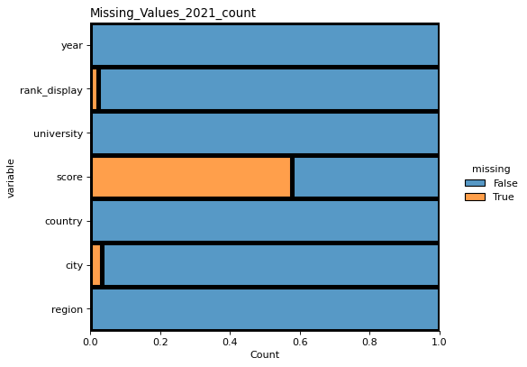
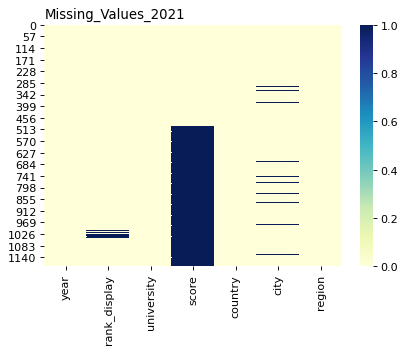

# ETL-Project-Group-1

## Project Subject  

### Quacquarelli Symonds (QS) World University Rankings 2017-2022  

Dataset source:

https://www.kaggle.com/prasertk/qs-world-university-rankings-2021?select=QS+World+University+Rankings+combined.csv. 
https://www.kaggle.com/juanmah/world-cities. 

QS University website: https://www.topuniversities.com/  

##### Team members

Anh Huong 
Daniela Cornea 
Aravind Sama 
Mino Peric 

## Project Proposal

Review, analyse and group the QS World University Rankings by using CSV files available on Kaggle:

https://www.kaggle.com/prasertk/qs-world-university-rankings-2021?select=QS+World+University+Rankings+combined.csv.  

The selected dataset contains a number of six CSV files, one for each year, plus one for the combined data. The database to be created will include information from at least four files, being for ranking for the period 2019 - 2022.  

The database is a relational database being structured in tables for universities and ranking. 

QS World University Rankings is published annually by UK company "Quacquarelli Symonds" (QS) that analysis higher education institutions around the world and publish the results, in the current form, since 2004. The list contains more than 1000 universities and it is a trusted reference for top universities in the world. 

Suggested files allocation 

Anh Huong, "QS World University Rankings 2022.csv" 
Daniela Cornea, "QS World University Rankings 2021.csv" 
Aravind Sama, "QS World University Rankings 2020.csv" 
Mino Peric, "QS World University Rankings 2019.csv" 

## Project plan and development 

With a quick analysis in Excel by using Pivot Table, it can be noted that the number of universities varies from a year to another one and there are missing values in different columns such as rank, city and score. 

Project plan and development:

Each member of the team works with at least one CSV file, drop the logo and link columns, and retain year, rank_display, university, score, country, city and region.

Check the files for missing values by using different methods such as heat map visualisation.

  

  

#### Extract

The original data was formatted in CSV files by year with specific columns for university, rank_display, score, country, region, city, logo and link. The datatype differs, and for 2021, as an example, the year column has datatype integer, the score is float and all the other columns are object.

The original data contains numbers or ranges for rank_display and some rows contain special characters such as "-" and "+".

Each file has around 1000 rows, representing universities around the world.

#### Transform

Data cleaning required for the files included:   

- replace NAN values in the "score" column with zero,   
- rename "rank_display" column as "rank"and replace NAN values with zero, retain the lower rank, drop unnecessary information such as special characters, remove "=" sign that appears in front of the rank in some rows.

#### Load

Database UniRankingDC created in PGAdmin includes 3 tables: cities, universities and uni_rank.

Cities table has three headings: city, country and region. This table is to be updated with the cities where universities are located. Some universities offer study programs in more than one city.

The headings for universities table are university, country, city and region. This table is intended to be a list with all universities.

The table uni_rank has the following headings university, year, rank, score. This table contains information about ranking by year. It permits analysing and plotting data for a longer period.

## Data Analytics

From 2017 to 2021, the Massachusetts University of Technology (MIT), Stanford University, and Harvard University took out first, second, and third place in the QS Top University rankings, respectively.

In 2022, MIT continued to be placed as the top-ranked university globally, with The University of Oxford being ranked second, Stanford University placing third, and Harvard University placing fifth overall. 

Consequently, for each year included in the study, the top ten university rankings consisted of universities from OECD-member countries, including USA, Switzerland and the United Kingdom, implying a positive correlation between high-university standards and high-income economies worldwide.

## Project Submission:

1. Folder "Resources": contains input data csv files
2. Folder "Output_DC": contains program output data files and graphs generated from pandas (by Daniela Cornea)
3. Anh Huong: ETL for year 2022 datafile, jupyter notebook: _QS_Uni_2022_ah.ipynb_, and SQL schema/query: _query_ah.sql_
4. Daniela Cornea: ETL for year 2021 datafile, jupyter notebook: _QS_Uni_2021_dc.ipynb_, and SQL schema/query: _query_dc.sql_, schema_dc.sql_
5. Mino Peric: ETL for year 2019 datafile, jupyter notebook: _QS_Uni_2019_MP.ipynb_, and SQL schema/query: _query_MP.sql_, _QDBD_overview_MP.png_
6. Aravind Sama: 
7. Team contribution: presentation pack: _ETL-Project-Group-1.pptx_ and ReadMe (this file)
